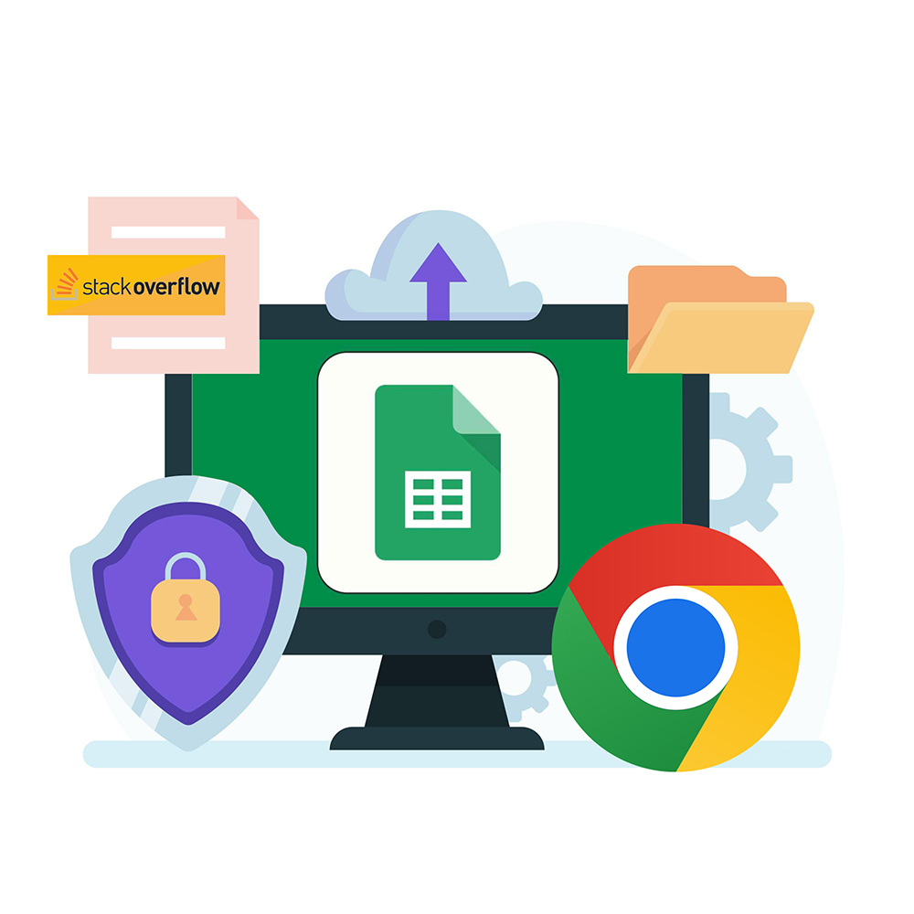

[](https://opensource.org/licenses/MIT)
[](https://developer.chrome.com/docs/extensions/reference/api/scripting)
[](https://uk.legacy.reactjs.org/)
[](https://nodejs.org/ru)
[](https://expressjs.com/ru/)
[](https://www.npmjs.com/package/googleapis)



# Stackoverflow saver

**_Built using Google Chrome Scripting API, NodeJs, Express & Google Spreedsheets_**.

This application is designed to help you efficiently save code snippets,
titles and links from Stack Overflow directly to your Google Sheets.

## Features and Fuctionality


- Add copy button to DOM elements (copy code to clipboard)
- Add save button to DOM elements (save code, title link and date to Google Sheets)

## Load extension to chrome

1. Go to `chrome://extensions/` and click Load Unpacked
2. Load `build` folder

## Start server

1. Go to `extension` folder
2. Add your credentials.json (Google Spreedsheets Credentials)
3. Run start command

```
npx nodemon server.js
```

## Contributing

Contributions are welcome! If you have any suggestions or improvements, please create a pull request. For major changes, please open an issue first to discuss the changes.

**_NOTE: PLEASE LET ME KNOW IF YOU DISCOVERED ANY BUG OR YOU HAVE ANY SUGGESTIONS_**
